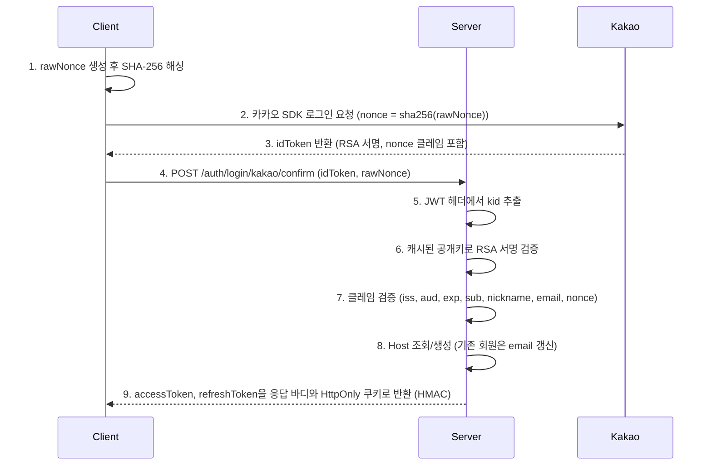
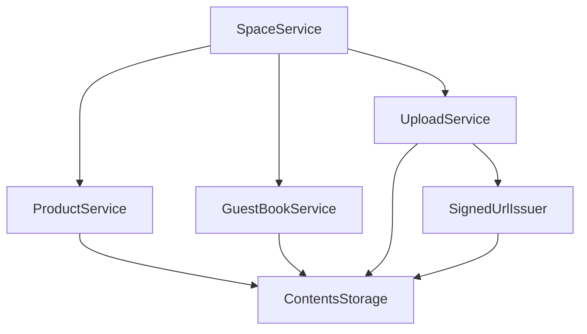
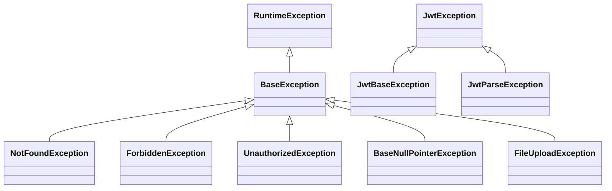
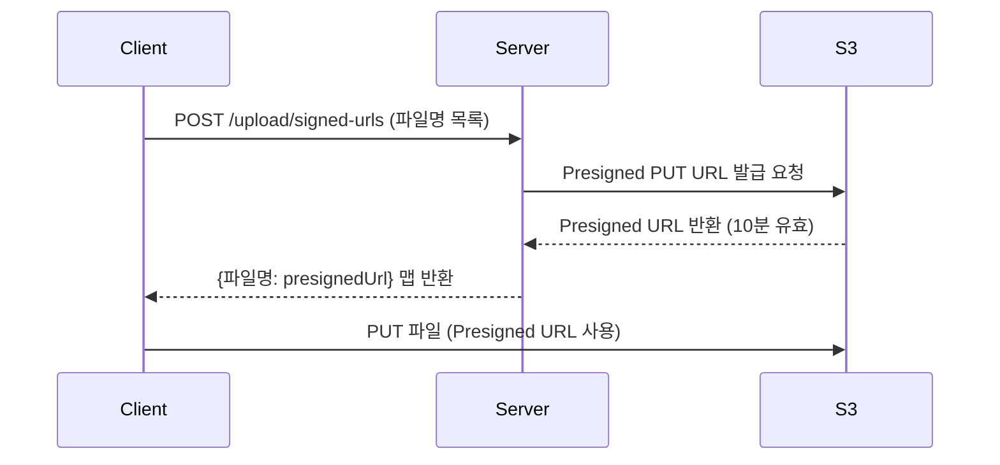

# 아키텍처 상세

## 레이어드 아키텍처

```
Controller → Service → Repository → Entity
     ↓           ↓
   DTO      Domain Logic
```

### 요청/응답 흐름
1. Controller: HTTP 요청 수신, Request DTO 검증
2. Service: 비즈니스 로직 조합, 트랜잭션 관리
3. Repository: 데이터 접근
4. Entity: 도메인 로직, 불변성 보장

---

## 인증/보안 아키텍처

### JWT 토큰 구조

프로젝트는 두 가지 JWT 토큰을 사용합니다:

| 토큰 타입 | 용도 | 서명 방식 | 만료 시간 |
|----------|------|----------|----------|
| Access Token | API 인증 | HMAC-SHA256 | 설정값 기반 |
| Refresh Token | 토큰 갱신 | HMAC-SHA256 | 설정값 기반 |

```java
// JwtTokenProvider - 토큰 생성 (global/auth/util/JwtTokenProvider.java)
private String buildAccessToken(Long id, String role) {
    Date now = new Date();
    Date expiry = new Date(now.getTime() + (jwtProperties.getAccessTokenExpiration() * 1000));

    return Jwts.builder()
        .subject(String.valueOf(id))
        .claim("id", id)
        .claim("role", role)  // HOST 또는 ADMIN
        .issuedAt(now)
        .expiration(expiry)
        .signWith(getSigningKey())  // HmacSHA256
        .compact();
}
```

### Host vs Admin 인증 분리

| 구분 | Host (작가) | Admin (관리자) |
|-----|------------|---------------|
| 인증 방식 | JWT + 소셜 OAuth (Kakao·Apple, Authorization 헤더 또는 HttpOnly 쿠키) | JWT + 세션 |
| 리졸버 | `LoginHostArgumentResolver` | `LoginAdminUserArgumentResolver` |
| 인터셉터 | - | `AdminAuthInterceptor` |
| 어노테이션 | `@LoginHost` | `@LoginAdminUser` |
| 경로 | `/spaces/**`, `/products/**` 등 | `/admin/**`, `/view/admin/**` |

```java
// LoginHostArgumentResolver - @LoginHost 처리 (domain/host/resolver/LoginHostArgumentResolver.java)
@Override
public Host resolveArgument(MethodParameter parameter, ...) {
    String jwtToken = resolveJwtToken(request); // Authorization 헤더 우선, 없으면 access_token 쿠키
    if (jwtToken == null) {
        throwExceptionIfRequired(required);
        return null;
    }

    jwtTokenProvider.validateToken(jwtToken);

    if (!jwtTokenProvider.getRole(jwtToken).equals(HOST)) {
        throw new UnauthorizedException("호스트 로그인이 필요합니다.");
    }

    Long hostId = jwtTokenProvider.getId(jwtToken);
    return hostRepository.getByIdOrThrow(hostId);
}
```

### Kakao OAuth 플로우



#### JWKS 공개키 관리

JWKS 조회는 provider(KAKAO/GOOGLE/APPLE) 공통으로 `SocialPublicKeyClient`가 담당합니다.

```java
// SocialPublicKeyClient - provider별 JWKS 캐시에서 공개키 조회 (global/external/social/SocialPublicKeyClient.java)
public PublicKey getPublicKey(SocialProvider provider, String kid) {
    List<Map<String, Object>> keys = keyCaches.get(provider);
    if (keys == null || keys.isEmpty()) {
        synchronized (getKeyUpdateLock(provider)) {  // provider 단위 락으로 중복 갱신 방지
            // double-checked locking 후 updateKeys(provider)
        }
    }

    Optional<PublicKey> publicKey = findPublicKey(keys, kid);
    if (publicKey.isPresent()) {
        return publicKey.get();
    }

    // kid를 못 찾으면 키 로테이션으로 보고 갱신 후 재조회
    synchronized (getKeyUpdateLock(provider)) {
        updateKeys(provider);
    }
    return findPublicKey(keyCaches.get(provider), kid)
        .orElseThrow(() -> new JwtBaseException("Public key not found ...", HttpStatus.UNAUTHORIZED));
}
```

```java
// SocialPublicKeyScheduler - 매일 새벽 3시 전체 provider 키 갱신
// (global/external/social/SocialPublicKeyScheduler.java)
@Scheduled(cron = "0 0 3 * * *")
public void updateSocialPublicKeys() {
    socialPublicKeyClient.updateAllKeys();  // KAKAO, GOOGLE, APPLE
}
```

#### id token 클레임 검증

서명 검증 이후 `SocialJwtParser`가 provider별로 클레임을 검증합니다. 카카오·애플 모두 `nonce`를 필수로 요구하며, 클라이언트가 원본을 SHA-256 해싱해 provider에 전달했다고 보고 해시를 대조합니다.

```java
// SocialJwtParser - Kakao id token 클레임 검증 (global/external/social/SocialJwtParser.java)
private void validateKakaoIdToken(KakaoIdToken idToken, String rawNonce) {
    // iss  : kakao.issuer와 일치
    // aud  : kakao.native-app-key와 일치 (문자열 또는 배열)
    // exp  : 존재
    // sub, nickname, email : 존재 (카카오 콘솔에서 닉네임·이메일 필수 동의)
    // nonce: hashRawNonce(rawNonce)와 일치
}
```

---

## 서비스 레이어

### 서비스 의존성 그래프



### 주요 서비스 역할

| 서비스 | 역할 | 의존 서비스 |
|-------|------|------------|
| `SpaceService` | 전시 공간 CRUD, 삭제 시 하위 리소스 정리 | ProductService, GuestBookService, UploadService |
| `ProductService` | 작품 CRUD (최대 3개 제한) | ContentsStorage |
| `GuestBookService` | 방명록 CRUD, 권한 검증 | ContentsStorage |
| `UploadService` | 파일 업로드, Presigned URL 발급 | ContentsStorage, SignedUrlIssuer |
| `AuthService` | OAuth 로그인, 토큰 갱신 | SocialJwtParser, JwtTokenProvider, AppleApiClient |

### 트랜잭션 경계

| 메서드 유형 | 어노테이션 | 설명 |
|------------|---------|------|
| 조회 | `@Transactional(readOnly=true)` | 읽기 전용 최적화, Dirty Checking 비활성화 |
| 생성/수정/삭제 | `@Transactional` | 기본 쓰기 모드 |

```java
// 조회 예시 - ProductService
@Transactional(readOnly = true)
public ProductsResponse getAll(String spaceCode) {
    Space space = spaceRepository.getByCodeAndDeletedAtIsNullOrThrow(spaceCode);
    List<Product> products = productRepository.findAllBySpaceAndDeletedAtIsNull(space);
    // ...
}

// 삭제 예시 - SpaceService (하위 리소스 일괄 삭제)
@Transactional
public void delete(String spaceCode, Host host) {
    Space space = spaceRepository.getByCodeAndDeletedAtIsNullOrThrow(spaceCode);
    validateSpaceHost(space, host);
    deleteGuestBookAndProduct(host, space);  // 하위 서비스 호출
    deleteSpaceHost(host, space);
    deleteSpacePhoto(space);
    space.delete();
}
```

---

## 패키지별 역할

### global/

| 패키지 | 역할 |
|-------|------|
| `auth/` | JWT 토큰 생성·검증(`JwtTokenProvider`), 인증 쿠키 처리(`AuthCookieProvider`) |
| `config/` | WebMvc, S3, Swagger, 비동기 처리 등 설정 |
| `exception/` | 전역 예외 처리, BaseException 계층 |
| `util/` | 공용 유틸리티 (TextLengthCounter, RandomCodeGenerator 등) |
| `logging/` | 로깅 인터셉터, 비동기 로깅 데코레이터 |
| `converter/` | Multipart JSON 컨버터 |

### domain/
각 도메인은 다음 구조를 따름:
```
{domain}/
├── controller/  # REST API 엔드포인트
├── service/     # 비즈니스 로직
├── repository/  # 데이터 접근
├── model/       # 엔티티, 값 객체
└── dto/         # 요청/응답 DTO
```

### back_office/
- 관리자 전용 기능 (Thymeleaf 기반)
- 세션 기반 인증 (JWT와 분리)
- 별도의 인터셉터(`AdminAuthInterceptor`), 리졸버(`LoginAdminUserArgumentResolver`) 사용

---

## 설정 클래스

### 주요 Config 클래스

| 클래스 | 역할 | 위치 |
|--------|------|------|
| `S3Config` | S3Client, S3AsyncClient, S3Presigner, S3TransferManager 빈 | `global/config/` |
| `SwaggerConfig` | OpenAPI 3.0 설정, JWT Bearer 인증 스키마 | `global/config/` |
| `WebConfig` | CORS, 인터셉터, ArgumentResolver, MessageConverter 등록 | `global/config/` |
| `AsyncConfig` | 비동기 TaskExecutor 설정 (corePoolSize=4, queueCapacity=1000) | `global/config/` |
| `RestClientConfig` | RestClient 빈 (외부 API 호출용) | `global/config/` |

```java
// AsyncConfig - 비동기 처리 설정 (global/config/AsyncConfig.java)
@Bean
public TaskExecutor taskExecutor() {
    ThreadPoolTaskExecutor taskExecutor = new ThreadPoolTaskExecutor();

    // corePoolSize = Number of Available Cores * Target CPU utilization * (1 + Wait time / Service time)
    // ec2 타입인 t4g.small의 cpu 코어 수 = 2, I/O 대기시간이 긴 작업 -> 2 * 2 = 4
    taskExecutor.setCorePoolSize(4);
    taskExecutor.setQueueCapacity(1000);  // OOM 방지용
    taskExecutor.setTaskDecorator(new LoggingTaskDecorator());
    taskExecutor.setThreadNamePrefix("async-task-");
    return taskExecutor;
}
```

### Properties 클래스

| 클래스 | 역할 |
|--------|------|
| `JwtProperties` | JWT secret, 토큰 만료 시간 |
| `S3Properties` | 버킷명, 리전, 루트 디렉토리, 태깅 |
| `KakaoProperties` | 카카오 네이티브 앱 키(`aud` 검증 기준), issuer, JWKS URL, Admin 키, unlink URL |
| `AppleProperties` | 애플 client ID, issuer, JWKS URL, client secret 서명용 키 |
| `CorsProperties` | 허용 origin, method, header |

---

## 예외 처리 전략

### 예외 계층 구조



### BaseException 핵심 메서드

```java
// BaseException.java (global/exception/BaseException.java)
public boolean isClientError() {
    return status.is4xxClientError();
}

public boolean isSecurityError() {
    return status.isSameCodeAs(HttpStatus.UNAUTHORIZED)
        || status.isSameCodeAs(HttpStatus.FORBIDDEN);
}
```

### 로그 레벨 전략

| 예외 유형 | 로그 레벨 | 설명 |
|----------|---------|------|
| `MethodArgumentNotValidException` 등 | INFO | 예측 가능한 클라이언트 에러 |
| `JwtException`, `ForbiddenException`, `UnauthorizedException` | WARN | 주의 필요한 보안 관련 에러 |
| `BaseException` (4XX) | INFO | 비즈니스 로직 예외 |
| `BaseException` (5XX), `Exception` | ERROR | 스택 트레이스 포함 |

```java
// GlobalExceptionHandler.java (global/exception/GlobalExceptionHandler.java)
@ExceptionHandler(BaseException.class)
public ResponseEntity<ErrorResponse> handleBaseException(BaseException e) {
    if (e.isSecurityError()) {
        logClientWarning(e);
    } else if (e.isClientError()) {
        logClientInfo(e);
    } else {
        logServerError(e);  // 스택 트레이스 포함
    }
    return ResponseEntity.status(e.getStatusCode())
        .contentType(APPLICATION_JSON)
        .body(ErrorResponse.from(e.getMessage()));
}

private void logServerError(Exception e) {
    log.atError().setCause(e).log("{}: {}", e.getClass().getSimpleName(), e.getMessage());
}
```

---

## 외부 연동

### AWS S3

#### Presigned URL 발급 흐름



```java
// AwsS3Cloud - Presigned URL 발급 (domain/upload/AwsS3Cloud.java)
@Override
public String issueSignedUrl(String path) {
    PutObjectRequest objectRequest = PutObjectRequest.builder()
        .bucket(s3Properties.getBucketName())
        .key(path)
        .tagging(s3Properties.getTagging())
        .build();

    PutObjectPresignRequest preSignRequest = PutObjectPresignRequest.builder()
        .signatureDuration(Duration.ofMinutes(10L))  // 10분 유효
        .putObjectRequest(objectRequest)
        .build();

    PresignedPutObjectRequest preSignedRequest = s3Presigner.presignPutObject(preSignRequest);
    return preSignedRequest.url().toString();
}
```

#### 파일 삭제 배치 처리

S3 `deleteObjects` API는 한 번에 최대 1,000개 객체만 삭제 가능합니다.

```java
// AwsS3Cloud - 배치 삭제 (domain/upload/AwsS3Cloud.java)
private static final int MAX_DELETE_COUNT = 1_000;

private void executeBatchDeletion(List<String> deletePaths) {
    for (int i = 0; i < deletePaths.size(); i += MAX_DELETE_COUNT) {
        List<String> batch = deletePaths.subList(i, Math.min(i + MAX_DELETE_COUNT, deletePaths.size()));
        DeleteObjectsResponse response = executeObjectsDeletion(batch);
        if (response.hasErrors()) {
            retryObjectsDeletion(response);  // 실패 시 1회 재시도
        }
    }
}
```

#### 썸네일 경로 생성 규칙

원본 이미지 삭제 시 관련 썸네일도 함께 삭제됩니다.

```
원본: {rootDir}/{spaceCode}/product/{uuid}.jpg
썸네일:
  - {rootDir}/{spaceCode}/product/thumbnails/{uuid}_x800.webp  (모바일)
  - {rootDir}/{spaceCode}/product/thumbnails/{uuid}_x1080.webp (데스크톱)
```

### Kakao OAuth

#### 인증 플로우 상세

1. **클라이언트**: rawNonce 생성 → `sha256(rawNonce)`를 카카오 SDK의 `nonce`로 넘겨 로그인 → `idToken` 획득
2. **클라이언트**: `idToken`과 **원본** `rawNonce`를 서버로 전송 (`raw_nonce`는 필수)
3. **서버**: JWT 헤더에서 `kid` 추출 → `SocialPublicKeyClient`의 JWKS 캐시에서 공개키 조회
4. **서버**: RSA 공개키로 `idToken` 서명 검증
5. **서버**: `SocialJwtParser.validateKakaoIdToken`으로 클레임 검증 (`iss`, `aud`, `exp`, `sub`, `nickname`, `email`, `nonce`)
6. **서버**: `sub` (카카오 사용자 ID)로 Host 조회/생성. 기존 회원은 `Host.updateEmail`로 이메일 갱신
7. **서버**: HMAC-SHA256으로 서명된 `accessToken`, `refreshToken`을 응답 바디와 HttpOnly 쿠키로 발급

#### 스케줄러

- **클래스**: `SocialPublicKeyScheduler` (`global/external/social/`)
- **실행 주기**: 매일 새벽 3시 (`0 0 3 * * *`)
- **동작**: `SocialPublicKeyClient.updateAllKeys()` — KAKAO·GOOGLE·APPLE JWKS를 한 번에 갱신
- **목적**: provider가 키를 로테이션해도 서비스 중단 없이 검증 가능

---

## 설계 결정 사항

### Soft Delete
모든 핵심 엔티티는 `SoftDeleteEntity` 상속:
- `deletedAt` 필드로 삭제 상태 관리
- 실제 데이터 삭제 대신 삭제 시간 기록
- 데이터 복구 및 감사 추적 가능

### 값 객체 패턴
사진 목록은 일급 컬렉션으로 관리:
- `ProductPhotos`: 작품 사진 컬렉션
- `GuestBookCardPhotos`: 방명록 사진 컬렉션
- 사진 개수 제한, 순서 관리 등 비즈니스 규칙 캡슐화

---

## 데이터베이스 마이그레이션
- Flyway 사용
- 마이그레이션 파일: `src/main/resources/db/migration/`
- 네이밍: `V{버전}__{설명}.sql`
